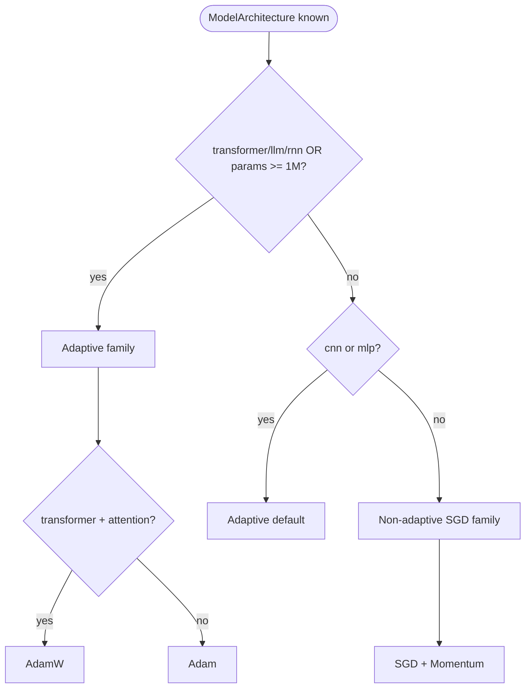

# Decision Trees (Prototype v0.1)

## HPO method narrowing

## Optimizer narrowing

## Planned stages (not yet implemented)

- Search-space prioritization (lr, batch, wd, dropout order)
- Range suggestion per optimizer
- Diagnosis branch from `TrainingObservation`
