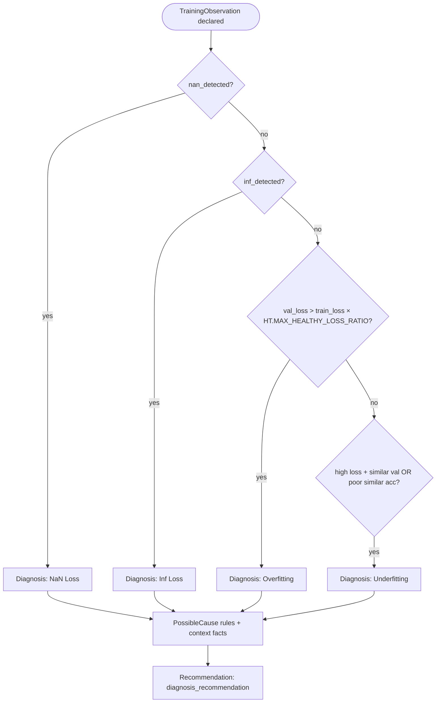

# Decision Trees (Prototype v0.1)

## HPO method narrowing

## Optimizer narrowing

## Search-space prioritization (lr, batch, wd, dropout order, lr_schedule , lr_warmup)
flowchart TD
    Start([System Inputs Known]) --> C1{has_gpu == False OR max_trials <= 20? Strict Resource Check}
    
    %% Strict Resource Branch
    C1 -->|Yes| R1{uses_batch_norm == True AND architecture_type == cnn?}
    R1 -->|Yes| BN_Safe["[Resource & BN Constraint Mode] Freeze: batch = 16, schedule = constant, dropout = 0 Priority 1: lr Priority 2: wd"]
    R1 -->|No| Safe_Def["[Extreme Focus Mode] Freeze: batch = 8/16, wd, dropout, schedule = constant Priority 1: lr"]
    
    %% High Resource Branch
    C1 -->|No| G1{Optimization Goal?}
    
    G1 -->|maximize_accuracy| Goal_Acc["[Accuracy Mode - fANOVA 65% Effect] Priority 1: batch Priority 2: lr Priority 3: lr_schedule Freeze: dropout order, wd"]
    
    G1 -->|minimize_training_time| Goal_Time["[Speed Mode - fANOVA 54% Effect] Priority 1: lr Freeze: batch to max hardware limits, wd, dropout, schedule = fixed_linear"]
    
    %% Balanced Goal Branch
    G1 -->|balanced| A1{Architecture Type?}
    
    A1 -->|transformer| Arch_Trans["[Adaptive Context Focus] Priority 1: lr Priority 2: wd Freeze: batch, dropout order Mandatory: Include LR Warmup"]
    
    A1 -->|cnn| O1{High Overfitting Risk? model_scale == large AND dataset_size == small}
    O1 -->|Yes| CNN_Reg["[Spatial Regularization Mode] Priority 1: lr Priority 2: batch Priority 3: wd & dropout"]
    O1 -->|No| CNN_Standard["[Spatial Standard Mode] Priority 1: lr Priority 2: batch Freeze: wd, dropout"]

    %% Catch-All Safe Fallback Mechanism
    A1 -->|other/unmapped| FallbackNode["[Safe Default Space Mode] Priority 1: lr Priority 2: batch Freeze: wd, dropout, schedule"]
    G1 -->|other/unmapped| FallbackNode

    
## Planned stages (not yet implemented)

- Range suggestion per optimizer
- Diagnosis branch from `TrainingObservation`

## Post-training diagnosis (v0.2)

Knowledge acquisition: see [KNOWLEDGE_ACQUISITION_DIAGNOSIS.md](KNOWLEDGE_ACQUISITION_DIAGNOSIS.md).
Thresholds: `utils/heuristic_thresholds.py`.

