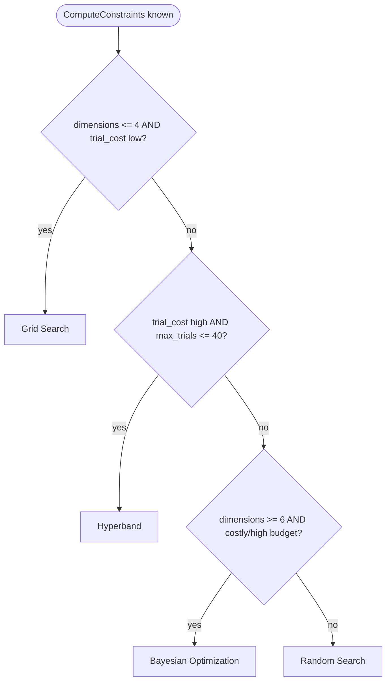

# Decision Trees (Prototype v0.1)

## HPO method narrowing

## Optimizer narrowing

## Search-space prioritization (lr, batch, wd, dropout order, lr_schedule, lr_warmup)
flowchart TD
    Start([System Inputs Known]) --> C1{has_gpu == False OR max_trials <= 20? Strict Resource Check}
    
    %% Strict Resource Branch
    C1 -->|Yes| R1{uses_batch_norm == True AND architecture_type == cnn/mlp?}
    R1 -->|Yes| BN_Safe["[Resource & BN Constraint Mode] Freeze: batch = 16, schedule = constant, dropout = 0 Priority 1: lr Priority 2: wd (small)"]
    R1 -->|No| Safe_Def["[Extreme Focus Mode] Freeze: batch = 8/16, wd, dropout, schedule = constant Priority 1: lr"]
    
    %% High Resource Branch
    C1 -->|No| A1{Architecture Type?}
    
    A1 -->|transformer / llm / rnn| Arch_Trans["[Adaptive Context Focus] Priority 1: lr Priority 2: wd Freeze: batch, dropout Mandatory: Include LR Warmup"]
    
    A1 -->|cnn / mlp| O1{High Overfitting Risk? model_scale == large AND dataset_size == small}
    O1 -->|Yes| CNN_Reg["[Spatial Regularization Mode] Priority 1: lr Priority 2: dropout Priority 3: batch Priority 4: wd"]
    O1 -->|No| CNN_Standard["[Spatial Standard Mode] Priority 1: lr Priority 2: dropout Priority 3: batch Freeze: wd"]

    %% Catch-All Safe Fallback Mechanism
    A1 -->|other/unmapped| FallbackNode["[Safe Default Space Mode] Priority 1: lr Priority 2: batch Freeze: wd, dropout, schedule"]
    

## Range suggestion per optimizer
flowchart TD
    %% OPTIMIZER-BOUND PARAMETERS
    Opt_Split{Selected Optimizer?}

    %% ADAMW BRANCH
    Opt_Split -->|AdamW| AW_Arch{Architecture Type?}
    AW_Arch -->|transformer / llm / rnn| AW_Trans["[AdamW Sequential Context]
    • lr: [1e-5, 1e-3] (Log-Uniform)
    • weight_decay: [1e-2, 1e-1] (Log-Uniform)"]
    AW_Arch -->|cnn / mlp / other| AW_CNN["[AdamW CNN/MLP Context]
    • lr: [1e-4, 1e-2] (Log-Uniform)
    • weight_decay: [1e-4, 1e-2] (Log-Uniform)"]

    AW_Trans --> AW_Fixed["[AdamW Fixed Constants]
    • beta1: 0.9
    • beta2: 0.999
    • epsilon: 1e-8"]

    AW_CNN --> AW_Fixed

    %% ADAM BRANCH
    Opt_Split -->|Adam| A_Adam["[Adam Context]
    • lr: [1e-4, 1e-2] (Log-Uniform)
    • weight_decay: [1e-6, 1e-3] (Log-Uniform) 
    • beta1: 0.9
    • beta2: 0.999
    • epsilon: 1e-8"]

    %% SGD BRANCH
    Opt_Split -->|SGD + Momentum| SGD_SGD["[SGD Context]
    • lr: [1e-3, 1e-1] (Log-Uniform)
    • momentum: 0.9
    • weight_decay: [1e-4, 1e-2] (Log-Uniform)"]

    %% CONTEXT-BOUND PARAMETERS
    Start2([Context-Bound Parameters]) --> Param_Split{Which Parameter?}

    Param_Split -->|batch_size| HW_Check{has_gpu}
    HW_Check -->|Yes| Batch_High["[High-Performance Hardware]
    • Range: [32, 256]
    • Scale: Powers of 2"]
    HW_Check -->|No| Batch_Low["[Resource-Constrained]
    • Range: [16, 64]
    • Scale: Powers of 2"]

    Param_Split -->|dropout| Overfit_Check{model_scale == large AND dataset_size == small?}
    Overfit_Check -->|Yes| DO_High["[High Regularization]
    • Range: [0.3, 0.6] (Uniform)"]
    Overfit_Check -->|No| DO_Standard["[Standard Regularization]
    • Range: [0.0, 0.3] (Uniform)"]